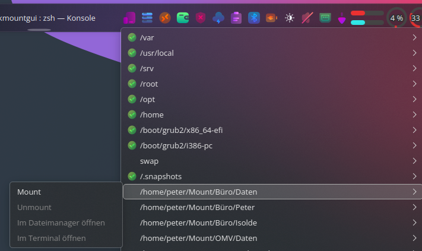

# README for PKMountGUI

## Description

PKMountGUI is a small Python PyQt6 tool that provides a handy tray application to manage your custom `/etc/fstab` entries.
You can quickly mount and unmount mount points, open them in your file manager, or launch a terminal at that location.

---

### Screenshots

| Systray Menu                     |
|----------------------------------|
|  |

---

## Installation

1. **Install Dependencies**  
   Make sure Python 3 and PyQt6 are installed:

   ```bash
   sudo apt install python3 python3-pyqt6  # Example for Debian/Ubuntu
   ```

2. **Project Files**  
   Copy `pkmountgui.py` and `create_desktop_entry.py` into the same directory.

3. **Create Desktop Entries**  
   Run the helper script to create a system menu entry and desktop shortcut:

   ```bash
   sudo python3 create_desktop_entry.py
   ```

---

## Usage

- Launch the app from the system menu or desktop shortcut.
- The tray icon shows your custom fstab mount points.
- For each mount point you can mount, unmount, open in file manager, or open in terminal.
- The application regularly checks the status of mount points and shows it with colored dots.

---

## Notes

- Only non-system-critical fstab entries are shown.
- Entries with the `user` option are mounted without root privileges.
- For other mounts, password input might be required for mount/unmount (via `pkexec`).

---

## License

(C)2025 Peter Kasparak under the MIT License  
This project is open source, do what you want.
