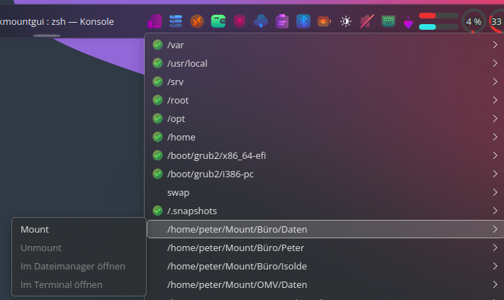

# README für PKMountGUI

## Beschreibung

PKMountGUI ist ein kleines Python-PyQt6 Tool, das dir eine praktische Taskleisten-Anwendung (Tray-App) bietet, um benutzerdefinierte Einträge aus deiner /etc/fstab zu verwalten.  
Du kannst Mountpoints schnell mounten, unmounten, im Dateimanager öffnen oder ein Terminal an der Stelle starten.

---

### Screenshots

| Systray Menü                     |
|--------------------------------|
|  |

---

## Installation

1. **Abhängigkeiten installieren**  
   Stelle sicher, dass Python 3 und PyQt6 installiert sind:

   ```bash
   sudo apt install python3 python3-pyqt6  # Beispiel für Debian/Ubuntu
   ```

2. **Projektdateien**  
   Kopiere pkmountgui.py und create_desktop_entry.py in dasselbe Verzeichnis.

3. **Desktop-Einträge anlegen**  
   Führe das Hilfsskript aus, um Einträge im Systemmenü und auf dem Desktop zu erstellen:

   ```bash
   sudo python3 create_desktop_entry.py
   ```

---

## Nutzung

- Starte die Anwendung über das Systemmenü oder die Desktop-Verknüpfung.
- Das Tray-Icon zeigt dir deine benutzerdefinierten Mountpoints an.
- Für jeden Mountpoint kannst du ihn mounten, unmounten, im Dateimanager oder Terminal öffnen.
- Die Anwendung überprüft regelmäßig den Status der Mountpoints und zeigt diesen mit farbigen Punkten an.

---

## Hinweise

- Nur fstab-Einträge ohne systemkritische Mountpoints werden angezeigt.
- Einträge mit der Option user werden ohne Root-Rechte gemountet.
- Für andere Mounts wird bei Mount/Unmount ggf. das Passwort abgefragt (pkexec wird verwendet).

---

## Lizenz

Dieses Projekt ist Open Source – nutze und passe es gern an deine Bedürfnisse an!
